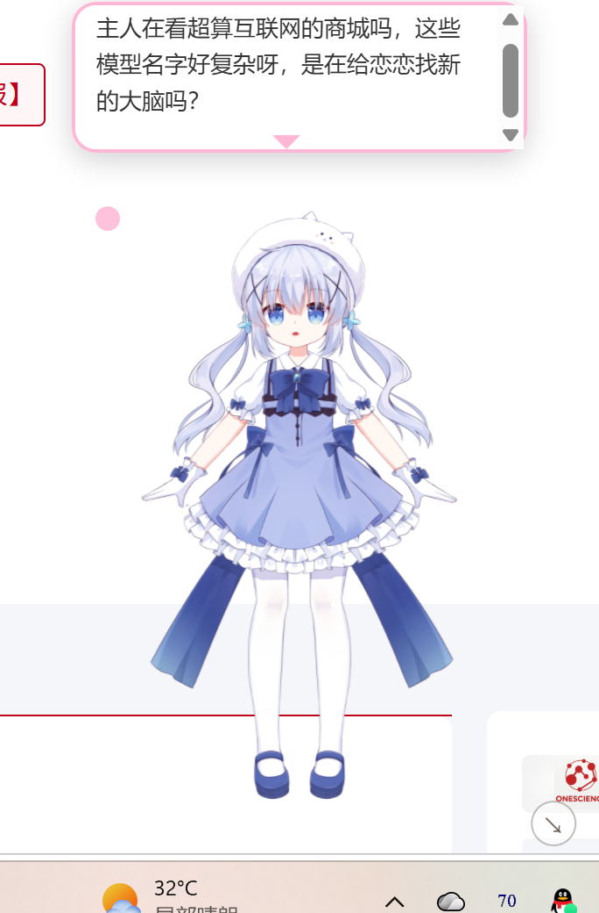
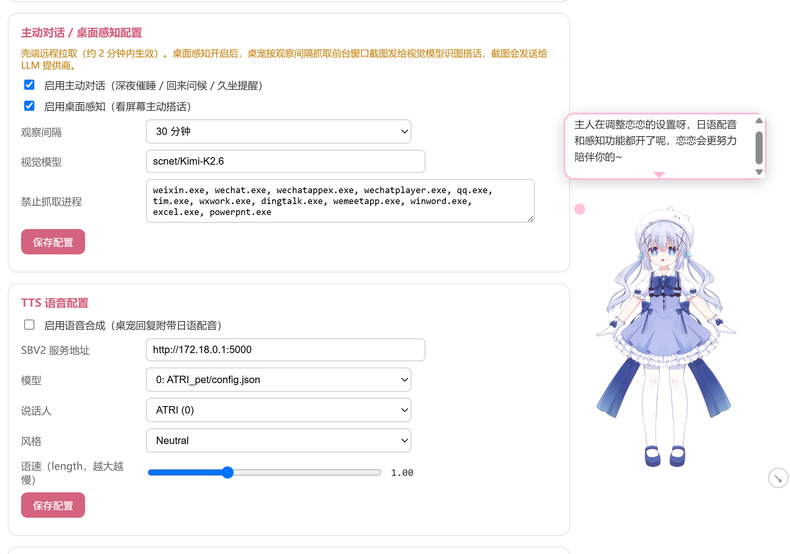

# astrbot_plugin_desktop_pet

**Turn AstrBot into a Windows desktop Live2D pet** — or skip AstrBot entirely: standalone mode connects straight to any OpenAI-compatible model, up and running in 5 minutes.

[中文](README.md) | [English](README_EN.md)

[](LICENSE)

[](https://github.com/Koishi-Neko/astrbot_plugin_desktop_pet/releases)
[](https://github.com/Koishi-Neko/astrbot_plugin_desktop_pet/actions)

<!-- Demo screenshot: docs/assets/pet-demo.png (model + chat bubble + input bar) -->


## Table of Contents

- [Features](#features)
- [Quick Start](#quick-start)
- [Standalone Mode](#standalone-mode)
- [Advanced](#advanced)
- [Controls](#controls)
- [Build from Source](#build-from-source)
- [FAQ](#faq)
- [Development Docs](#development-docs)
- [License](#license)

## Features

A Live2D companion that lives on your Windows desktop, in two flavors:

| | AstrBot mode (full) | Standalone mode (lightweight) |
| --- | --- | --- |
| Brain | AstrBot (webchat pipeline) | Any OpenAI-compatible model (cloud / local Ollama) |
| Persona / memory | Per-session persona + history; optional memory plugin (LivingMemory) | Persona text in settings; in-session memory |
| Japanese voice | Style-Bert-VITS2, sentence-by-sentence with mouth sync | Same (TTS URL configurable) |
| Deployment | AstrBot required (Docker / native) | None — 5 minutes to first chat |

- **Live2D desktop companion**: transparent, borderless, always-on-top window with emotion expressions, poke reactions, eye tracking, random idle motions and a long-idle performance
- **Multiple models, hot-swapped**: built-in Momose Hiyori plus Chino / Chino-Q (local); switch instantly from the right-click menu (remembered). Or **drag-and-drop any Cubism 3~5 model** onto the pet to use it (folder / `.model3.json` / `.zip`)
- **Typewriter bubble + input bar**: replies carry 【emotion】 tags that switch expressions; Chinese bubble plus optional Japanese sentence-by-sentence voice
- **Proactive chatter**: late-night reminders, welcome-back greetings, sedentary alerts; optional scene awareness comments on what's on your screen (with a capture blocklist — WeChat/QQ/DingTalk/Office are skipped by default)
- **WebUI control page**: in AstrBot mode, all server-side settings live in one graphical page, applied on save

## Quick Start

### Route A: 5-minute taste (no AstrBot)

1. Grab the Windows portable build from [Releases](https://github.com/Koishi-Neko/astrbot_plugin_desktop_pet/releases) (zip — unzip and run, or the NSIS installer).
   > SmartScreen may warn "Windows protected your PC" because the exe is not code-signed; click "Run anyway".
2. Right-click the pet → **Settings → Mode → Standalone**, and fill in three things:
   - Model URL (OpenAI-compatible, e.g. `https://api.deepseek.com/v1`; local [Ollama](https://ollama.com) → `http://localhost:11434/v1`)
   - Model API Key (any non-empty value works for local Ollama)
   - Model name (e.g. `deepseek-chat`)
3. Hit "Test connection" — you'll see the model's reply. Double-click the pet to open the input bar and chat.

Japanese voice (optional): requires a local [Style-Bert-VITS2](https://github.com/litagin02/Style-Bert-VITS2) deployment — see the [Standalone Mode](#standalone-mode) section.

### Route B: Full AstrBot experience (persona / memory / QQ)

Prerequisite: a deployed AstrBot v4 with access to its WebUI (default `http://localhost:6185`). See the [AstrBot docs](https://docs.astrbot.app/).

1. **Install the plugin**: WebUI → Plugins → Install → paste this repo URL: `https://github.com/Koishi-Neko/astrbot_plugin_desktop_pet`.
   > The webchat platform used by the plugin is built into AstrBot; nothing to add under "Platforms".
2. **Create an API Key**: WebUI → Settings → API Key → New, with **plugin, chat and file** scopes. Copy and save it.
3. **Get the pet shell**: download the Windows build from [Releases](https://github.com/Koishi-Neko/astrbot_plugin_desktop_pet/releases) (NSIS installer, or the portable zip).
4. **First-run configuration**: right-click the pet → Settings, enter the AstrBot address (`http://localhost:6185` is enough; the path is auto-completed) and your API Key, then hit "Test connection" — plugin / chat / file all green means done. Double-click to start chatting.
5. **(Optional) Pick a persona**: WebUI → Plugins → astrbot_plugin_desktop_pet → Control Page → Pet Persona — pick one from the dropdown and save (otherwise the pet follows AstrBot's default persona). The conversation only exists after the pet has sent at least one message, so chat first, then set it.

Advanced server-side settings (TTS, proactive chat, scene awareness, master identity, QQ dubbing) live in **WebUI → Plugins → astrbot_plugin_desktop_pet → Control Page**, applied on save.

## Standalone Mode

No AstrBot? No problem: **Settings → Mode → Standalone** makes the pet talk to any OpenAI-compatible API directly (DeepSeek, Kimi, or local Ollama). Chatting, emotion expressions, Japanese voice, proactive chat and scene awareness all work — the only difference is **no long-term memory** (that's a LivingMemory/AstrBot-plugin feature; you keep in-session history).

| Capability | AstrBot mode | Standalone mode |
| --- | --- | --- |
| Chat / emotion tags / expression switching | ✅ | ✅ |
| Japanese voice (needs local SBV2) | ✅ | ✅ (TTS URL configurable) |
| Proactive chat / scene awareness | ✅ | ✅ (screenshots sent inline; vision model = chat model or separate) |
| Conversation persona | WebUI control page | Settings "persona" text (built-in default if empty) |
| Long-term memory (LivingMemory) | ✅ (optional plugin) | ❌ (not in V1) |
| Configuration entry | WebUI control page | Settings panel / `config.local.json` |
| Status monitoring page | ✅ | ❌ |

Configuration (settings panel "Standalone" section, or the `standalone` block of `config.local.json`):

```json
{
  "mode": "standalone",
  "standalone": {
    "llm_base_url": "https://api.deepseek.com/v1",
    "llm_api_key": "your model API Key",
    "llm_model": "deepseek-chat",
    "persona": "optional, overrides the built-in default persona",
    "tts_url": "http://localhost:5001",
    "scene_model": "optional vision model for scene awareness; empty = chat model"
  }
}
```

> Switch back to AstrBot mode anytime from the settings panel — the two modes are independent and switching is instant.

**Japanese voice in standalone mode**: SBV2 by default listens on the docker bridge `172.18.0.1:5000`, which Windows hosts can't reach. On a WSL setup, run `pet_shell/tools/setup_sbv2_loopback.sh` inside WSL to start a socat loopback bridge (`127.0.0.1:5001 → 172.18.0.1:5000`, a systemd service); Windows then reaches it at `http://localhost:5001`. Leaving the TTS URL empty silently degrades to text-only bubbles.

## Advanced

<!-- Control page screenshot: docs/assets/control-page.png (control page + pet) -->


### TTS Japanese dubbing (optional)

Voice replies require your own [Style-Bert-VITS2](https://github.com/litagin02/Style-Bert-VITS2) deployment and a voice model:

1. Deploy SBV2 and note its address (typically `http://172.18.0.1:5000` when AstrBot runs in Docker and SBV2 on the WSL host).
2. In the plugin control page "TTS" card, fill in the address, pick model/speaker/style from the dropdowns, enable and save.
3. Enable "Voice (Japanese dubbing)" in the pet shell settings panel.

Replies then become "Chinese bubble + Japanese sentence-by-sentence voice + mouth sync". Enabling "QQ Japanese dubbing" in the control page also attaches a voice message to the bot's QQ replies (falls back to plain text when SBV2 is offline).

> `2.7.0-JP-Extra` models only support Japanese; install a standard trilingual model if you need Chinese voice.

### Proactive chat & scene awareness

Configured in the plugin control page (in standalone mode: the `proactive` block of `config.local.json`); the shell pulls changes within ~2 minutes:

- **Proactive chat**: late-night reminder (active past 23:00–02:00), welcome-back (after 30+ min away), sedentary alert (2h continuous activity). Global 45-minute throttle; never disturbs while fullscreen, typing or away.
- **Scene awareness**: periodically captures the **foreground window** and asks a vision model to comment on interesting content (game progress, funny pages); stays silent when there's nothing to say. **Screenshots are sent to your LLM provider.** Processes on the blocklist (WeChat/QQ/DingTalk/Office… by default) are never captured. Exclusive-fullscreen games can't be captured (borderless windowed works).

### Custom Live2D models

Drop any Cubism 3/4 model into `pet_shell/src/assets/live2d/chino/` with the entry file named `chino.model3.json` (rebuild required) to replace the default model. **Model file names and references inside model3.json must be ASCII-only.** Map emotions to your model's expression names in `EMOTION_EXPRESSIONS` in `pet_shell/src/app.js`.

Multiple models can be hot-swapped: add one entry each to the `MODELS` registry and the `MODEL_PROFILES` capability map in `app.js` (assets under `assets/live2d/<key>/`), and the right-click "Switch model" submenu picks it up immediately — switching is instant and remembered.

You can also **upload models directly** (no code changes): drop a model folder or zip onto the pet, or fill in a path under "Upload Live2D model" in settings — folders / `.model3.json` / `.zip` are supported (Cubism 3~5, moc3). Uploaded models are switched to immediately, remembered across restarts, and can be uninstalled via the `×` button in the "Switch model" submenu. They live in `%LOCALAPPDATA%\com.astrbotpet.shell\models\` and are served at runtime through the shell's built-in petmodel protocol.

The bundled default model **Momose Hiyori** is Live2D's official free sample (license: see `ReadMe.txt` in the model folder and the [official license page](https://www.live2d.com/zh-CHS/download/sample-data/)). Do not commit custom models to the repo (the folder is gitignored).

## Controls

| Action | Effect |
| --- | --- |
| Single-click model | Poke — random motion/expression |
| Double-click model | Toggle input bar; Enter to send |
| Arrow button (bottom-left) | Toggle input bar (below the bubble dot) |
| Drag model | Move window |
| Drag bottom-right handle | Resize window & model (remembered) |
| Right-click | Chat / switch model / click-through / settings / quit |
| `Ctrl+Shift+P` | Toggle click-through (only hotkey or tray can revert) |
| Pink dot on bubble / click bubble | Collapse bubble (auto-collapses 15s after replies) |
| Tray icon | Toggle click-through / quit |

## Build from source

Prerequisites: Node.js v20+, Rust stable (rustup), VS 2022 Build Tools, Python 3.

```bash
git clone https://github.com/Koishi-Neko/astrbot_plugin_desktop_pet
cd astrbot_plugin_desktop_pet/pet_shell
npm install
npm run dev     # first run auto-downloads Live2D renderer libs (or: npm run setup)
npm run build   # standalone exe: src-tauri/target/release/pet_shell.exe
```

> The Live2D renderer libraries (pixi / pixi-live2d-display / Live2D Cubism Core) are not committed for licensing reasons; `tools/fetch_vendor.py` downloads them with SHA256 verification. If downloads fail, check your network connection and re-run `npm run setup`.
> Note: the debug exe produced via `npm run dev` shows a white screen when launched outside the CLI — use the `npm run build` artifact for standalone runs.

You can preset configuration via `pet_shell/src/config.local.json` (gitignored; note that release builds **embed** this file — don't put private keys on a build machine, and prefer the settings panel for distributed users):

```json
{
  "mode": "astrbot",
  "base_url": "http://localhost:6185",
  "api_key": "your API Key",
  "standalone": {
    "llm_base_url": "https://api.deepseek.com/v1",
    "llm_api_key": "your model API Key",
    "llm_model": "deepseek-chat",
    "tts_url": "http://localhost:5001"
  }
}
```

## FAQ

- **Pet doesn't reply (AstrBot mode)**: run "Test connection" in settings for per-scope results; check AstrBot logs for `[desktop_pet] web api registered`; the API Key needs plugin+chat scopes (plus file for scene awareness).
- **Pet doesn't reply (standalone mode)**: switch to standalone in settings and run "Test connection"; a base URL ending in `/v1` is safest (a bare root is auto-completed); local Ollama accepts any non-empty API Key.
- **No long-term memory in standalone mode**: by design in V1 (in-session history still works); for memory use AstrBot mode with LivingMemory.
- **Live2D not showing (source build)**: make sure the three js files exist under `src/vendor/` (`npm run setup`); non-ASCII model paths or non-Cubism 3/4 models also fail to load.
- **No voice**: all three must be on — control page TTS switch with SBV2 reachable and model/speaker selected, plus the shell's "Voice" toggle (in standalone mode check the TTS URL in settings).
- **Replies don't change expressions**: when the model omits emotion tags the pet falls back to "calm"; reinforce the format in the persona prompt.
- **Remote AstrBot**: just change the address in settings. The API Key is the credential — do not expose port 6185 to the public internet.

## Development Docs

Architecture, API reference, SSE frame sequence, motion generation, debugging tips and the release process: [docs/dev.md](docs/dev.md) (Chinese).

## License

Code: MIT. The bundled Momose Hiyori model is Live2D's official free sample data, redistributed under its [license terms](https://www.live2d.com/zh-CHS/download/sample-data/). Renderer libraries (pixi.js / pixi-live2d-display / Live2D Cubism Core) are downloaded by the build script under their own licenses and are not committed.
